# 驭帧(FrameDriver) · 产品演示效果展示

> **驭帧让每一帧知识，都尽在掌控。**
>
> 输入一个主题，自动产出带语音讲解、字幕的 PPT 讲解视频。从想法到成片，全流程 AI 自动化，无需手动做 PPT、写讲稿、录音和剪辑。

---

## 产品使用流程

驭帧的全流程分为 5 个阶段，对应本文档的 5 个章节：

```
① 模型配置  →  ② 内容生成  →  ③ PPT 生成  →  ④ 视频生成  →  ⑤ 最终视频
```

---

## ① 模型配置

在开始使用前，先在「设置」页面完成大模型的基础配置。驭帧采用「模型管理」模式，支持同时维护多套模型配置，可随时切换默认模型，无需修改代码。

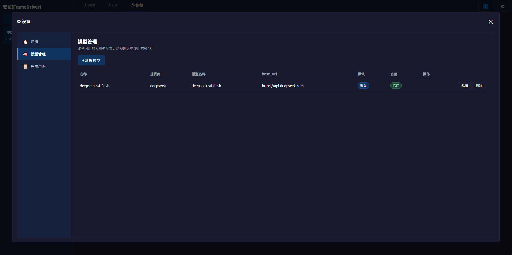

**功能说明：**
- **新增模型**：支持任意兼容 OpenAI 协议的大模型服务商（DeepSeek、通义、GPT 等）
- **多模型并存**：可维护多套 API Key，按需求切换启用
- **默认/启用**：设置默认模型、一键启停，灵活组合使用
- **编辑/删除**：随时修改模型参数或移除配置

---

## ② 内容生成

完成模型配置后，进入「内容」选项卡。只需输入一个主题，AI 即自动生成结构化的 PPT 大纲、每页要点及逐字讲解稿。可以展开ai生成的内容卡片进行手动编辑

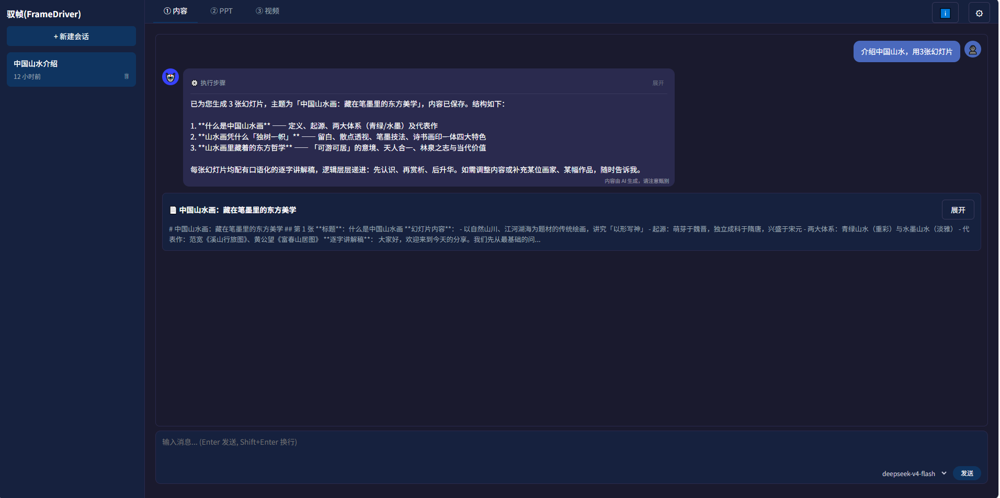

**展示示例**：输入主题「中国山水画：藏在笔墨里的东方美学」后，AI 自动产出 3 张幻灯片结构：

1. **"什么是中国山水画——从诞生说起"**：定义、起源、两大水体系（青绿/水墨）及代表作
2. **"山水画凭什么'独树一帜'"**：皴法、留白、意境与留白
3. **"山水画里藏着的东方哲学'"**：游春图的意境、天人合一、林泉之志与当代价值

**交互能力：**
- 每张幻灯片均配有**口语化逐字讲解稿**，可直接用于语音合成
- 支持多轮对话修改：调整内容、补充/删除某张、补充某幅画家作品等
- 生成结果结构清晰：标题 → 要点 → 逐字稿，一目了然

---

## ③ PPT 生成（幻灯片设计）

内容确认后，进入「PPT」选项卡。驭帧采用 **Orchestrator（主控）+ Worker（单张设计）** 的多智能体协作架构，逐张完成幻灯片的 HTML 设计与渲染。

### 3.1 人工介入决策

如果智能体有关于生成幻灯片的相关问题，智能体会以「问题确认」卡片向用户提问，例如幻灯片比例选择。需要你决策时主动介入，决策后继续执行，避免不合预期的返工。

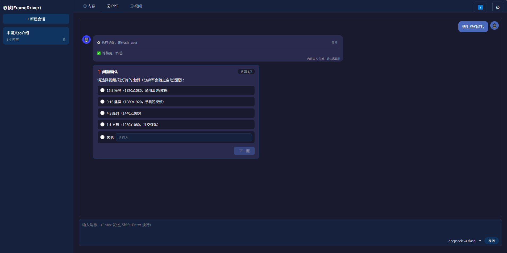

**支持的多张询问卡片：**
- 单选题
- 多选提
- 填空提
- 确认卡片


### 3.2 多幻灯片预览与操作

设计完成后，每张幻灯片独立卡片展示，支持逐张**预览、弹出预览、下载、播放（逐字稿）、编辑**等操作。

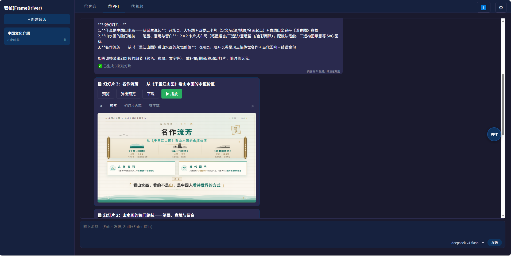

**核心能力：**
- **幻灯片卡片**：缩略图实时预览、逐字稿可折叠
- **逐张播放**：可观看幻灯片效果
- **弹出预览**：新标签页单独打开全屏查看
- **对话修改**：对内容、配色、布局、文字、增删/移动幻灯片随时提出调整要求
- **查看所有幻灯片卡片**：点击在聊天区域右侧浮动的ppt圆形按钮。


类断点式生成,例如如果要生成10张幻灯片，生成过这种可以随时点击停止，随后可以再继续生成。
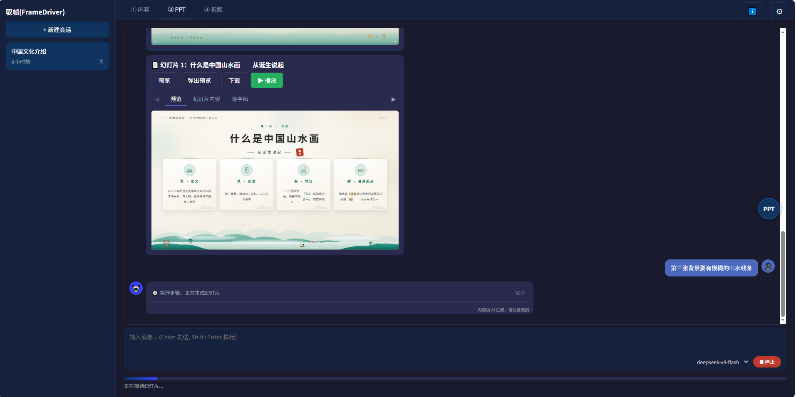
- 
### 3.3 统一风格呈现

每张幻灯片设计遵循整体统一的视觉规范，含**页眉、配色体系、图标、底纹装饰**，保证整本 PPT 风格一致而非单张割裂。

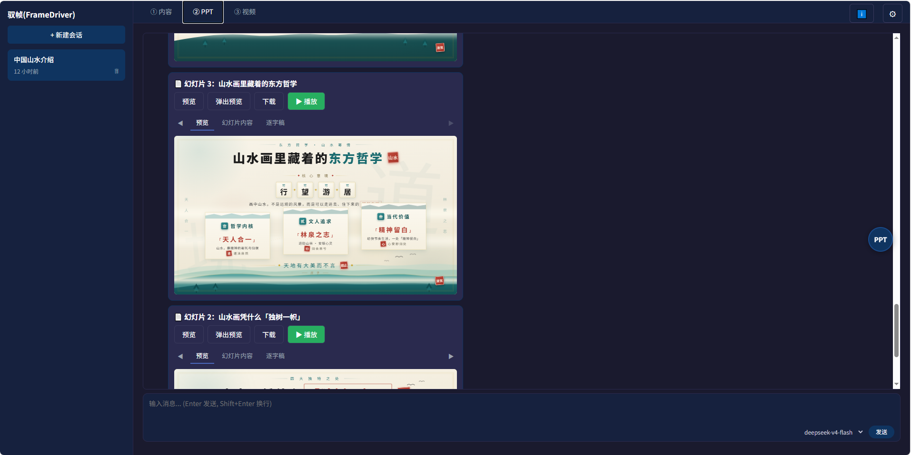

**设计特征：**
- 统一标题区（章节名、副标题、装饰标章）
- 结构化卡片分区（卡片标题 + 要点文本 + 视觉图标）
- 页面底部呼应装饰，保持系列感
- 配色、字体、间距全程一致，由 Orchestrator 统一下发 style_spec

### 3.4 弹出预览

点击「弹出预览」后，幻灯片以独立页面全屏呈现，左侧缩略导航方便跳转任意页，适合正式演示或导出前快速检查。

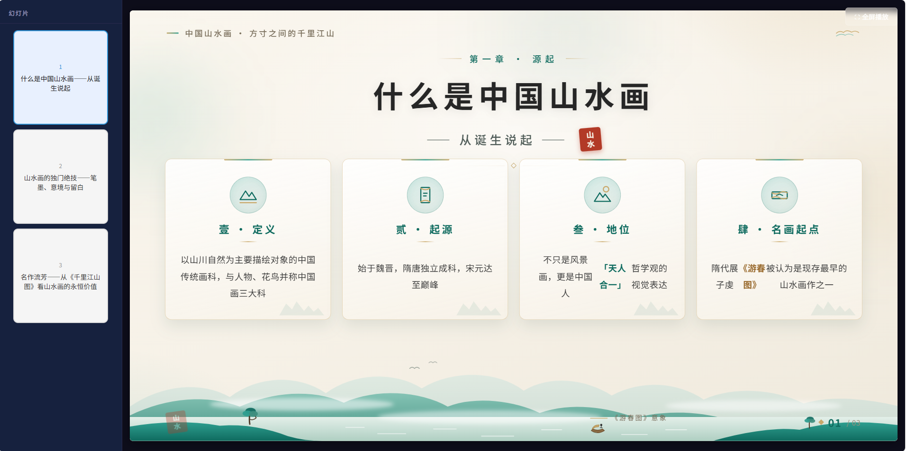

### 3.5 全屏模式

进入全屏模式后，幻灯片占满屏幕，鼠标进入最上面中间区域展示退出按钮，进入右侧，则右侧悬浮栏提供荧光笔快捷操作。

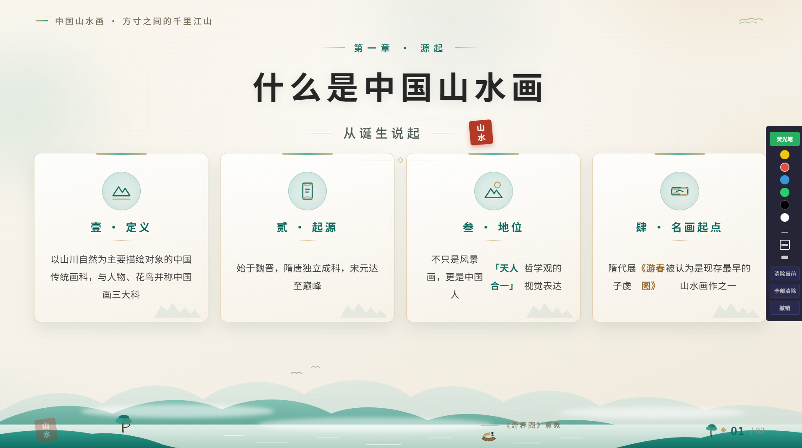

### 3.6 ppt打包下载
- **下载说明**：所有ppt幻灯片可以打包下载成一个独立的html页面，无需依赖任何软件，只需要有浏览器就可以运行查看（包含左侧缩略导航方便跳转任意页，全屏播放模式含荧光笔），
运行效果和在线弹出预览保持一致。
- **下载入口**：在ppt选项卡聊天区域右侧有浮动的ppt圆形按钮，点击可以查看所有的幻灯片，最下面有下载整套ppt按钮
---

## ④ 视频生成

PPT 设计完成后，进入「视频」选项卡。驭帧将执行「HTML → 高清截图 → 语音合成 → FFmpeg 合成」全自动流水线，产出带语音讲解与字幕的最终视频。

### 4.1 一键生成

「视频设置」区提供比例、分辨率、音色、字幕等核心参数，确认后点击「一键生成视频」即可。

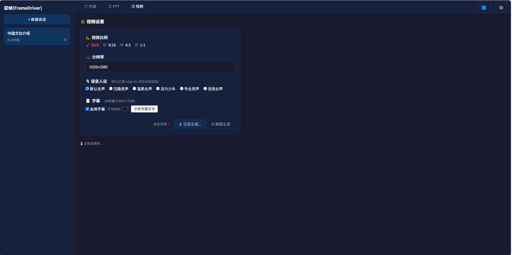


### 4.2 生成完成

视频生成完成后，顶部出现结果操作区，支持**下载视频、观看预览、分享**三个后续动作。

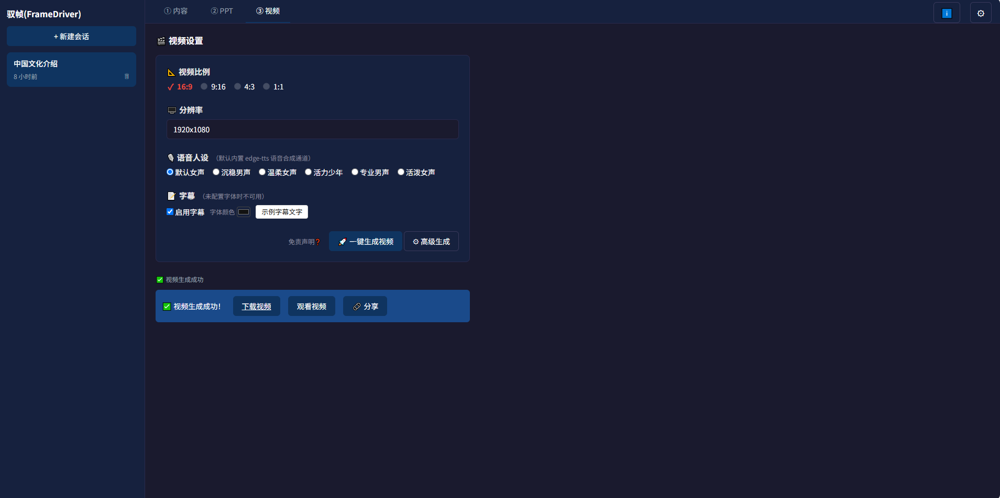

**结果操作：**
- **下载视频**：直接下载成品
- **观看视频**：内置播放器预览最终效果
- **分享**：生成唯一数字码分享链接（如 `/s/123`），手机/电脑均可访问

### 4.3 高级生成（选段合成）

点击「⚙ 高级生成」进入细粒度控制模式。可对每张幻灯片单独执行「生成/预览/播放」，并支持**勾选任意子集合成片段视频**，无需每次全量合成。

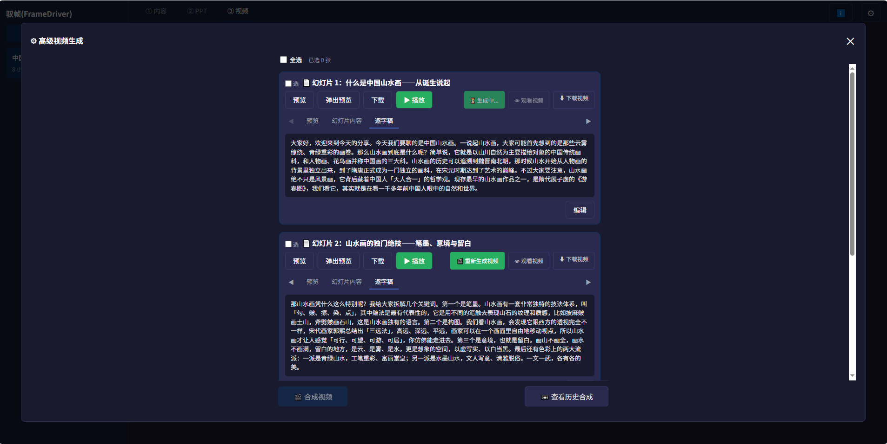

**高级能力：**
- **逐张生成**：单张幻灯片先单独生成 segment，确认后再合成整本
- **选段合成**：勾选任意几张幻灯片（如 1-3、4-6），独立输出片段视频
- **查看历史合成**：所有历史片段统一管理，支持下载、观看、分享、删除


---

## ⑤ 最终视频效果

全流程完成后，最终产出带逐字讲解与字幕的完整 PPT 讲解视频。视频比例、分辨率、音色、字幕均可按前述设置自由调整。

[▶️ 点击查看最终视频效果](img/v0.mp4)


**成品特征：**
- 每张幻灯片为一段独立画面，停留时长匹配逐字稿朗读时长
- 语音讲解：AI 合成自然音色，支持多角色选择
- 字幕：与语音同步出现，位置与颜色可配置（以上演示视频不包含字幕）
- 无缝拼接：页间转场平滑自然
---


**你只需要**：输入一个想法，检查并微调内容。剩下的——排版、写稿、配音、剪辑——全部交给驭帧。

> Author: AI Agent (guided by zhaoguangxi)